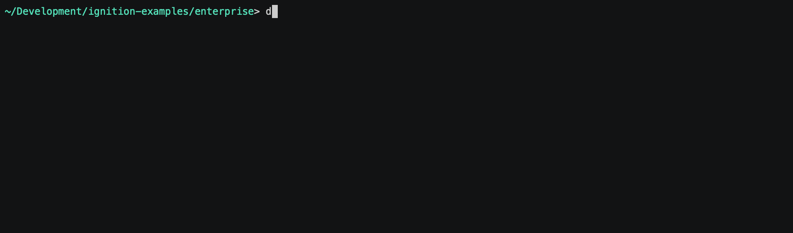

# Ignition Enterprise Architecture

With the Ignition enterprise architecture, you can send data from independent local sites and remote sites up to a centralized corporate site and to cloud services.

The Ignition enterprise architecture enables you to create a connected system while also securing data at multiple levels. Connect multiple sites to a central corporate server, and use Ignition Edge to ensure data from critical assets is never compromised. Connecting through a DMZ provides an additional layer of security for transferring and accessing data. The Ignition Gateway connects easily to cloud services like Microsoft Azure, AWS, IBM Cloud, and Google Cloud for storage and analytics.

## Configure

See [common configuration](../README.md#common-configuration) for specifics on files/folders in this solution.

## Enable

First, make sure your working directory is `enterprise`:

To bring up the solution:

    docker-compose up -d

## Connect

Once the solution has been launched, you can begin to access the services at:

- Central Ignition Gateway - http://central-gw.localtest.me:8088
- Site A Gateway - http://sitea-gw.localtest.me:8089
- Site A Edge Gateway - http://sitea-edge-gw.localtest.me:8090
- Site B Gateway - http://remote1-gw.localtest.me:8091
- MariaDB Database - `localhost:3306`

Default admin credentials for Ignition Gateways are `admin` / `password`. Default admin credentials for MariaDB are `root` / `ignition`.

## Monitor

If you'd like to monitor the logs of any of the services, you can use the following:

    docker-compose logs --tail=250 -f <service name>

... where `<service name>` is one of the named services from `docker-compose.yml`, e.g. `gateway` or `db`.  Omit the `<service name>` to start viewing logs from all services.  Use `CTRL-C` to break out of the log view.

## Shutdown

To shutdown the containers within the solution:

    docker-compose down

Note that this will leave data volumes intact on your system so that bringing the solution back online will return to the previous state.  If you want to also remove the data volumes and return the solution to the original state, add a `-v` flag to the *down* command.