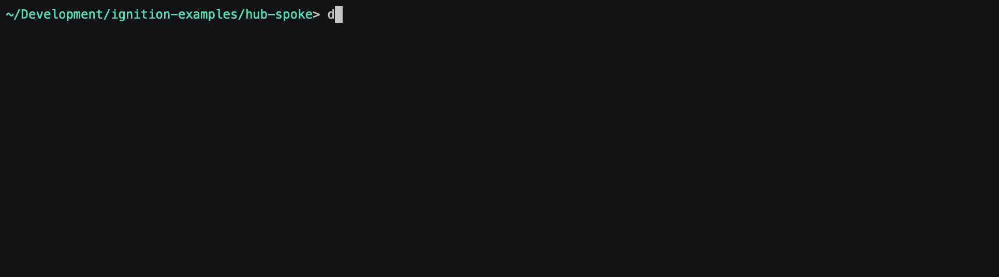

# Ignition Hub+Spoke Architecture

In the hub-and-spoke architecture, multiple local and remote sites are linked together by a central Ignition Gateway.

The hub and spoke architecture consists of two pieces. The hub piece consists of a central Ignition Gateway with Vision, Reporting and Mobile Modules and a database server. The spoke piece consists of a stripped-down Ignition Gateway with OPC UA and SQL Bridge Modules, dedicated for data logging. Each site is fully independent, operating with its own history, alarms, and clients, with the client Gateway being used for coordination and long-term history storage.

## Configure

See [common configuration](../README.md#common-configuration) for specifics on files/folders in this solution.

## Enable

First, make sure your working directory is `hub-spoke`:

To bring up the solution:

    docker-compose up -d

## Connect

Once the solution has been launched, you can begin to access the services at:

- Central Ignition Gateway - http://central-gw.localtest.me:8088
- Local Site Gateway - http://local1-gw.localtest.me:8089
- Remote Site Gateway - http://remote1-gw.localtest.me:8090
- MariaDB Database - `localhost:3306`
- MailHog SMTP Test Tool - http://mailhog.localtest.me:8025

Default admin credentials for Ignition Gateways are `admin` / `password`. Default admin credentials for MariaDB are `root` / `ignition`.

## Monitor

If you'd like to monitor the logs of any of the services, you can use the following:

    docker-compose logs --tail=250 -f <service name>

... where `<service name>` is one of the named services from `docker-compose.yml`, e.g. `gateway` or `db`.  Omit the `<service name>` to start viewing logs from all services.  Use `CTRL-C` to break out of the log view.

## Shutdown

To shutdown the containers within the solution:

    docker-compose down

Note that this will leave data volumes intact on your system so that bringing the solution back online will return to the previous state.  If you want to also remove the data volumes and return the solution to the original state, add a `-v` flag to the *down* command.