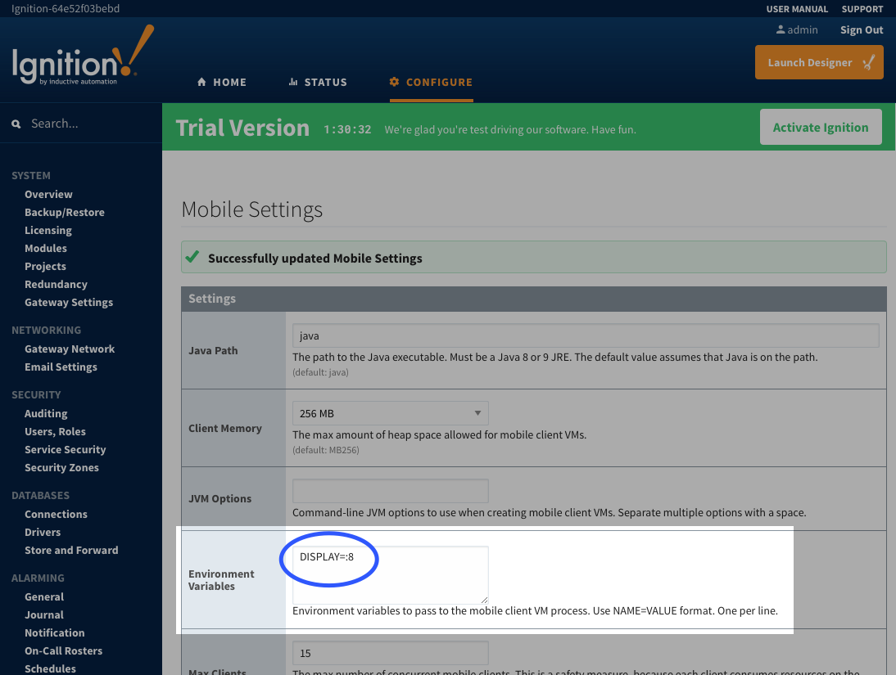

<!-- markdownlint-disable MD033 -->

# Ignition with Mobile Module

This Docker Compose solution shows how to use the Mobile Module with Ignition on Docker.  This solution uses an Xvfb server sidecar image based on the guidance [here](https://support.inductiveautomation.com/index.php?/Knowledgebase/Article/View/33/0/running-the-mobile-module-on-linux).

## Quick Start

See the sections later in this guide for more details on these commands, but this should get you running quickly if you're impatient 😝:

```bash
$ git clone https://github.com/thirdgen88/ignition-examples.git ignition-examples
Cloning into 'ignition-examples'..
$ cd ignition-examples/ignition-mobile  # Change to the Mobile Module Example Folder
$ docker-compose up -d && docker-compose logs -f  # Start the stack in detached mode and start to follow the logs (break with Ctrl-C)
...
```

## Configuring the Ignition Gateway Mobile Module

The key to this example is the sharing of the X11 socket that is created by the `xvfb` container at `/tmp/.X11-unix`.  There is one special piece of extra configuration that must be done on the Ignition Gateway side to enable things.

On the Ignition Gateway configuration webpage, find the _Mobile->Settings_ section and add `DISPLAY=:8` to the environment variables.  



## Starting the Services

Bring up the services with the command below:

    docker-compose up -d

This will start the containers in detached mode.  If you wish to monitor the log output of the containers:

    docker-compose logs -f

Use `CTRL-C` to break out of the log view.

## Shutting down the Services

To shut everything down and stop/remove containers and networks that were created in the _up_ process:

    docker-compose down

Since the relevant data for each of the containers is stored in volumes, the removal of the containers won't delete the state of your database or Ignition Gateway.

**USE WITH CAUTION**: If you also want to remove all of the volumes associated with your containers, know that this will reset to an initial state:

    docker-compose down -v

## Other

_Have a question?_  Take a look [here](https://github.com/thirdgen88/ignition-examples/issues) to see other questions about custom configurations for this stack.  Submit an issue yourself to get some guidance/help.  Just make sure to mention which example you're using.