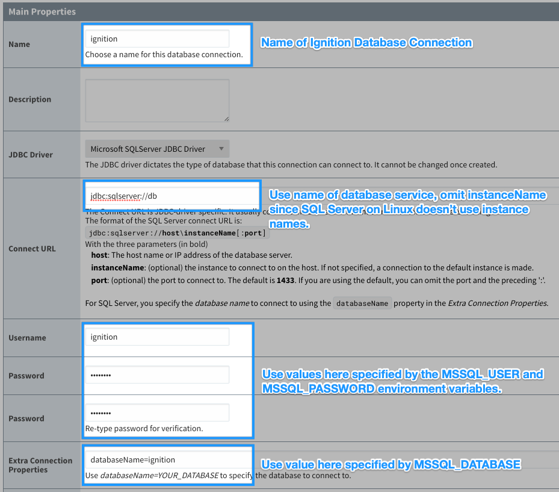

<!-- markdownlint-disable MD033 -->

# Ignition and Microsoft SQL Server

This Docker Compose solution utilizes the [kcollins/mssql](https://hub.docker.com/r/kcollins/mssql) image to initialize a default Microsoft SQL Server database for use with Ignition.

## Quick Start

See the sections later in this guide for more details on these commands, but this should get you running quickly if you're impatient 😝:

```bash
$ git clone https://github.com/thirdgen88/ignition-examples.git ignition-examples
Cloning into 'ignition-examples'..
$ cd ignition-examples/ignition-mssql  # Change to the SQL Server Example Folder
$ mkdir secrets
$ echo $(pwgen -1 32) | tee secrets/MSSQL_PASSWORD  # The tee command will echo the generated password to stdout and write to file
thot1giengae3euzaiRiet7AiYo0viox
$ echo $(pwgen -1 32) | tee secrets/SA_PASSWORD
Soo3mue6kiegai1aeNo9eLahyoj5eucu
$ echo $(pwgen -1 32) | tee secrets/GATEWAY_PASSWORD
joomahkaiNabaefaweyeic1iph7shaic
$ docker-compose up -d && docker-compose logs -f  # Start the stack in detached mode and start to follow the logs (break with Ctrl-C)
...
```

## Connecting to the Database from Ignition

With the sidecar container arrangement, the `gateway` service is able to communicate with the `db` service by-name, without any other special configuration.

By default, the database port `1433` is published to port `1433` on your host computer for easy administration via SQL Server Management Studio (SSMS), for example.  You can either change that port mapping definition to specify an alternative port for the host (e.g. "8433:1433" in order to route host port `8433` into the container's port `1433`) or comment it out altogether if you don't need external connectivity to the database.  The Ignition container will still be able to communicate with the `db` container via the internal network created by `docker-compose up`.

On the Ignition Gateway configuration webpage, use the following settings for connecting to the database container:



## Container Customization

Take a look at the README's for both the [kcollins/mssql](https://hub.docker.com/r/kcollins/mssql) and [kcollins/ignition](http://hub.docker.com/r/kcollins/ignition) Docker images for information on how to customize the containers.

Using the guidance there, you can do some other interesting things with this stack, such as:

- Placing a `my-database.bak` SQL Backup file in `db-init` folder to have the database restored automatically on first-launch.
- Placing customized `.sql` script files in `db-init` folder to have those files processed during first-launch.

## Setting up the Secrets

Before you start this stack, you need to define some secrets.  The [docker-compose.yml](docker-compose.yml) file is configured to look for files in the `secrets` folder: `MSSQL_PASSWORD` and `SA_PASSWORD` for the database, and `GATEWAY_PASSWORD` for the Ignition Gateway.  If you're on macOS or Linux, you can use the pwgen^1 utility to seed these password files with the commands below:

```bash
    $ echo $(pwgen -1 32) | tee secrets/MSSQL_PASSWORD
    thot1giengae3euzaiRiet7AiYo0viox
    $ echo $(pwgen -1 32) | tee secrets/SA_PASSWORD
    Soo3mue6kiegai1aeNo9eLahyoj5eucu
    $ echo $(pwgen -1 32) | tee secrets/GATEWAY_PASSWORD
    joomahkaiNabaefaweyeic1iph7shaic
```

Alternatively, simple place a password of your choosing in the files with a standard text editor.

## Starting the Services

Bring up the services with the command below:

    docker-compose up -d

This will start the containers in detached mode.  If you wish to monitor the log output of the containers:

    docker-compose logs -f

Use `CTRL-C` to break out of the log view.

## Shutting down the Services

To shut everything down and stop/remove containers and networks that were created in the _up_ process:

    docker-compose down

Since the relevant data for each of the containers is stored in volumes, the removal of the containers won't delete the state of your database or Ignition Gateway.

**USE WITH CAUTION**: If you also want to remove all of the volumes associated with your containers, know that this will reset to an initial state:

    docker-compose down -v

## Other

_Have a question?_  Take a look [here](https://github.com/thirdgen88/ignition-examples/issues) to see other questions about custom configurations for this stack.  Submit an issue yourself to get some guidance/help.  Just make sure to mention which example you're using.

<sup>1: Use `brew install pwgen` on macOS or `sudo apt install pwgen` on Ubuntu Linux to install the password generator utility</sup>