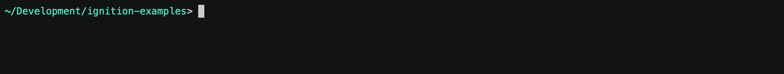
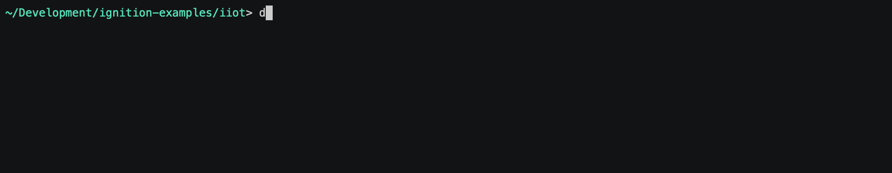

# Ignition IIoT Architecture

With the Ignition IIoT architecture you can set up a secure MQTT Message-Oriented Middleware (MOM) infrastructure in the Cloud, on a private on-premise network, or a hybrid of both.

Ignition IIoT can collects data from any devices at the edge of the network, publish that data to a central broker, and push that data to subscribed industrial and line-of-business applications. Ignition IIoT can connect to PLCs in the field through the use of the MQTT Transmission module, field devices with Ignition Edge MQTT installed, and/or MQTT-enabled edge gateways and field devices that use the Cirrus Link Sparkplug MQTT specification. This data is published to an MQTT broker, this broker can be located on-premise, in the cloud, or a hybrid of the two. The MQTT Engine module located on an Ignition Gateway can subscribe to any data published from the broker, this data can be use in any Ignition application.

LICENSING NOTE:  Use of this solution implies acceptance of the Cirrus Link MQTT Module EULAs as well as the standard Ignition EULA.  The EULAs are accepted on the user's behalf during automated launching of the associated Ignition Gateways.

## Configure

See [common configuration](../README.md#common-configuration) for specifics on files/folders in this solution.

## Enable

First, make sure your working directory is `iiot`:

To bring up the solution:

    docker-compose up -d

## Connect

Once the solution has been launched, you can begin to access the services at:

- Central Ignition Gateway - http://gateway.localtest.me:8088
- MQTT Distributor - `localhost:1883`
- Edge Gateway 1 - http://gateway-edge1.localtest.me:8090
- MariaDB Database - `localhost:3306`

Default admin credentials for Ignition Gateways are `admin` / `password`. Default admin credentials for MariaDB are `root` / `ignition`.

## Monitor

If you'd like to monitor the logs of any of the services, you can use the following:

    docker-compose logs --tail=250 -f <service name>

... where `<service name>` is one of the named services from `docker-compose.yml`, e.g. `gateway` or `db`.  Omit the `<service name>` to start viewing logs from all services.  Use `CTRL-C` to break out of the log view.

## Shutdown

To shutdown the containers within the solution:

    docker-compose down

Note that this will leave data volumes intact on your system so that bringing the solution back online will return to the previous state.  If you want to also remove the data volumes and return the solution to the original state, add a `-v` flag to the *down* command.