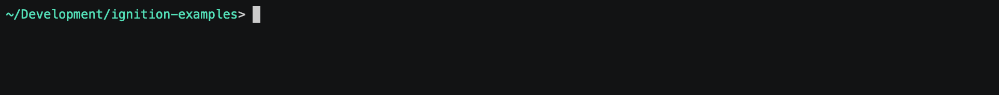
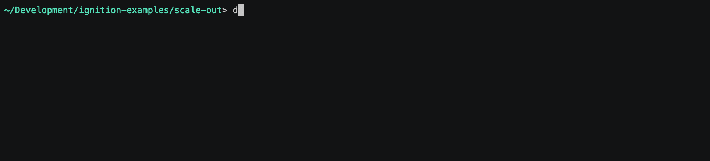

# Ignition Scale-Out Architecture

The scale-out architecture links together several Ignition Gateways to form a decentralized system.

With the scale-out architecture, the workload is split between tags and I/O Gateways that handle device data and front-end Gateways that handle client applications. This architecture scales out easily without overloading any single Gateway.

## Configure

See [common configuration](../README.md#common-configuration) for specifics on files/folders in this solution.

## Enable

First, make sure your working directory is `scale-out`:

To bring up the solution:

    docker-compose up -d

## Connect

Once the solution has been launched, you can begin to access the services at:

- Frontend Ignition Gateway - http://gateway-fe.localtest.me:8088
- I/O Ignition Gateway 1 - http://gateway-tag1.localtest.me:8090
- I/O Ignition Gateway 2 - http://gateway-tag2.localtest.me:8092
- MariaDB Database - `localhost:3306`

Default admin credentials for Ignition Gateways are `admin` / `password`. Default admin credentials for MariaDB are `root` / `ignition`.

## Monitor

If you'd like to monitor the logs of any of the services, you can use the following:

    docker-compose logs --tail=250 -f <service name>

... where `<service name>` is one of the named services from `docker-compose.yml`, e.g. `gateway` or `db`.  Omit the `<service name>` to start viewing logs from all services.  Use `CTRL-C` to break out of the log view.

## Shutdown

To shutdown the containers within the solution:

    docker-compose down

Note that this will leave data volumes intact on your system so that bringing the solution back online will return to the previous state.  If you want to also remove the data volumes and return the solution to the original state, add a `-v` flag to the *down* command.